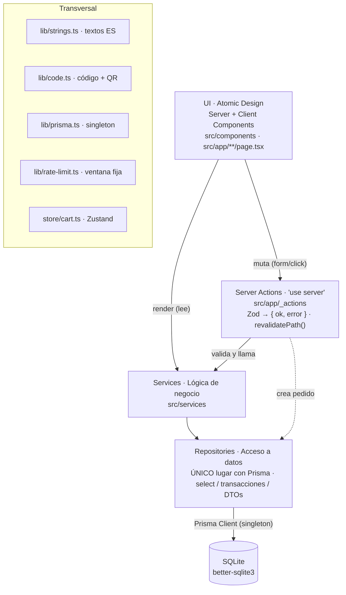
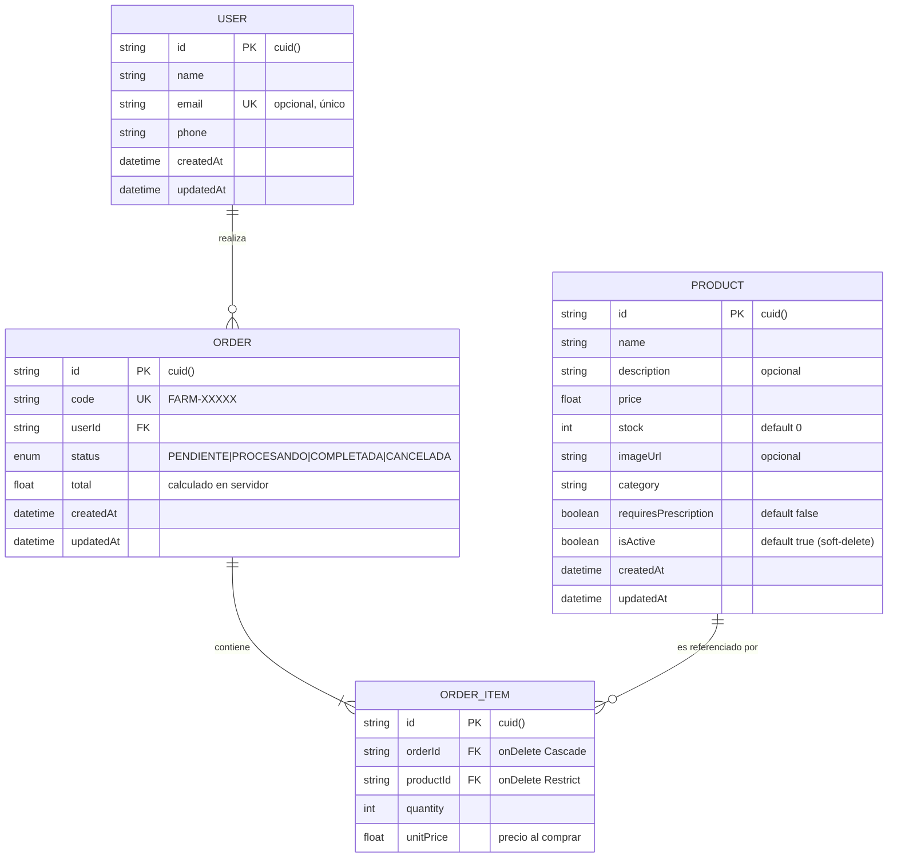

# Documentación Técnica — Farmacia Atenas (PWA)

> Aplicación Web Progresiva _mobile-first_ para una farmacia. El **cliente** arma un
> pedido desde el catálogo y recibe un **código + QR**; el **operador** recupera el
> pedido (tecleando el código o escaneando el QR) y lo marca como **completado**.

Este documento describe en detalle los estándares, la estructura del proyecto, los
patrones de diseño, las convenciones técnicas y el modelo de datos.

---

## Tabla de contenidos

1. [Stack tecnológico](#1-stack-tecnológico)
2. [Estructura del proyecto](#2-estructura-del-proyecto)
3. [Arquitectura por capas](#3-arquitectura-por-capas)
4. [Patrones de diseño aplicados](#4-patrones-de-diseño-aplicados)
5. [Capa de datos: repositorios y Prisma](#5-capa-de-datos-repositorios-y-prisma)
6. [Capa de servicios (lógica de negocio)](#6-capa-de-servicios-lógica-de-negocio)
7. [Validación con Zod](#7-validación-con-zod)
8. [Rutas y Server Actions (Next.js 16)](#8-rutas-y-server-actions-nextjs-16)
9. [Sistema de componentes (Atomic Design)](#9-sistema-de-componentes-atomic-design)
10. [Design System y tokens (Tailwind v4)](#10-design-system-y-tokens-tailwind-v4)
11. [Estado de cliente (Zustand)](#11-estado-de-cliente-zustand)
12. [PWA y configuración de seguridad](#12-pwa-y-configuración-de-seguridad)
13. [Internacionalización (strings)](#13-internacionalización-strings)
14. [Base de datos](#14-base-de-datos)
15. [Modelo Entidad-Relación (diagrama)](#15-modelo-entidad-relación-diagrama)
16. [Convenciones y estándares](#16-convenciones-y-estándares)
17. [Limitaciones conocidas y mejoras para producción](#17-limitaciones-conocidas-y-mejoras-para-producción)

---

## 1. Stack tecnológico

| Capa             | Tecnología                                              | Versión   |
| ---------------- | ------------------------------------------------------- | --------- |
| Framework        | Next.js (App Router, Server Components/Actions)         | `16.2.9`  |
| UI               | React                                                   | `19.2.4`  |
| Estilos          | Tailwind CSS                                            | `v4`      |
| Estado cliente   | Zustand                                                 | `5.0.x`   |
| Validación       | Zod                                                     | `4.4.x`   |
| ORM              | Prisma Client (generado en `src/generated/prisma`)      | `7.8.x`   |
| Base de datos    | SQLite vía adaptador `better-sqlite3`                   | `12.10.x` |
| PWA              | `@ducanh2912/next-pwa` (service worker + manifest)      | `10.2.x`  |
| Iconos           | `lucide-react` + iconos SVG propios                     | `1.18.x`  |
| QR / códigos     | `qrcode` + `nanoid`                                     | —         |
| Gestor paquetes  | **pnpm** (App Router, layout `src/`)                    | ≥ 9       |
| Lenguaje         | TypeScript `strict` + `noUncheckedIndexedAccess`        | `5.x`     |

> ⚠️ **Importante:** Este proyecto usa **Next.js 16** (no 13/14). Las APIs y
> convenciones difieren. Consultar `node_modules/next/dist/docs/` antes de escribir
> código específico de Next. Ver `AGENTS.md`.

**Tooling de calidad:**

- **ESLint 9** (flat config): `eslint-config-next` (core-web-vitals + typescript),
  `eslint-config-prettier` y `simple-import-sort` (ordenación de imports/exports).
- **Prettier**: `semi: true`, `singleQuote: false`, `trailingComma: "all"`,
  `printWidth: 100`, `tabWidth: 2`.
- **TypeScript**: `strict`, `noUncheckedIndexedAccess`, `moduleResolution: bundler`,
  alias `@/*` → `./src/*`.

---

## 2. Estructura del proyecto

```
pwa-pharmacy/
├── prisma/
│   ├── schema.prisma          # Modelo de datos (SQLite)
│   ├── migrations/            # 3 migraciones versionadas
│   └── seed.ts                # Datos de ejemplo (12 productos, 1 usuario, 2 pedidos)
├── public/
│   ├── manifest.json          # Manifiesto PWA
│   └── icons/                 # Iconos 192/512 (SVG)
├── src/
│   ├── app/                   # App Router (rutas, layouts, server actions)
│   │   ├── _actions/          # Server Actions ('use server')
│   │   ├── @modal/            # Slot de ruta paralela (modales interceptados)
│   │   ├── catalogo/ carrito/ producto/[id]/ pedido/[codigo]/ operador/
│   │   ├── layout.tsx page.tsx error.tsx not-found.tsx globals.css
│   │   └── apple-icon.tsx     # Icono Apple generado dinámicamente
│   ├── components/            # Atomic Design
│   │   ├── atoms/ molecules/ organisms/ templates/
│   ├── repositories/          # ÚNICO lugar que toca Prisma
│   ├── services/              # Lógica de negocio
│   ├── schemas/               # Esquemas Zod + tipos inferidos
│   ├── store/                 # Zustand (carrito)
│   ├── lib/                   # prisma, code, rate-limit, strings
│   ├── types/                 # Tipos públicos reexportados
│   └── generated/prisma/      # Cliente Prisma generado (NO editar)
├── next.config.ts             # PWA + cabeceras de seguridad + Turbopack
├── prisma.config.ts           # Config Prisma (schema, migraciones, seed)
├── eslint.config.mjs · .prettierrc · tsconfig.json
└── AGENTS.md · CLAUDE.md · README.md
```

---

## 3. Arquitectura por capas

**Regla de oro:** *solo los repositorios importan Prisma*. Ninguna página o componente
toca la base de datos directamente. Los precios y el total del pedido **se recalculan
siempre en el servidor** (nunca se confía en el cliente).



**Flujo de dependencias:** UI → (Services | Server Actions) → Services → Repositories
→ Prisma → SQLite. La validación Zod ocurre en los **límites** (Server Actions y
servicios). Los errores se mapean a mensajes en español en la capa de servicio.

---

## 4. Patrones de diseño aplicados

| Patrón                | Dónde                                   | Propósito                                                            |
| --------------------- | --------------------------------------- | ------------------------------------------------------------------- |
| **Repository**        | `src/repositories/*.repo.ts`            | Aísla el acceso a datos por entidad; expone DTOs, no entidades crudas. |
| **Service Layer**     | `src/services/*.service.ts`             | Orquesta lógica de negocio, validación y mapeo de errores.          |
| **Strategy**          | `recommendation.service.ts`             | `FrequentByUserStrategy` (historial) vs `TopSellersStrategy` (fallback). |
| **Factory**           | `lib/code.ts`                           | Genera código `FARM-XXXXX` legible + QR (Data URL).                  |
| **Singleton**         | `lib/prisma.ts`                         | Una única instancia de `PrismaClient` (preservada en HMR de dev).   |
| **DTO / Mapper**      | Repositorios (`select` + tipos `*Dto`)  | Proyecta solo los campos necesarios; no filtra datos internos.      |
| **Result type**       | Servicios y acciones                    | Retorna `{ ok: true, data } | { ok: false, error }` en vez de lanzar. |
| **Atomic Design**     | `src/components/**`                      | atoms → molecules → organisms → templates.                          |
| **Domain error**      | `OrderError` en `order.repo.ts`         | Errores tipados (`PRODUCT_NOT_FOUND`, `INSUFFICIENT_STOCK`).         |

---

## 5. Capa de datos: repositorios y Prisma

### `lib/prisma.ts` — Singleton

```ts
const rawUrl = process.env.DATABASE_URL ?? "file:./dev.db";
const url = rawUrl.replace(/^file:/, "");
const adapter = new PrismaBetterSqlite3({ url });
export const prisma = new PrismaClient({ adapter });
// En desarrollo se guarda en globalThis para sobrevivir al HMR.
```

El cliente se genera en `src/generated/prisma` (no en `node_modules`), importable vía
`@/generated/prisma/client`.

### Repositorios

Cada repositorio exporta **DTOs tipados** + un objeto con funciones puras. Usan
constantes `SELECT_*` reutilizables para las proyecciones.

| Repositorio              | Funciones clave (firma resumida)                                                                 |
| ------------------------ | ------------------------------------------------------------------------------------------------ |
| `user.repo.ts`           | `findById`, `findByEmail`, `findByPhone`, `create` → `UserDto`. Usuarios inmutables (sin update/delete). |
| `product.repo.ts`        | `findAll(filters)`, `findById`, `findByIds` (preserva orden), `findCategories`, `decrementStock`, `create`, `update`, `softDelete`, `hardDelete`, `countOrderItems`, y variantes `*ForManagement` (incluye inactivos). |
| `order.repo.ts`          | `findByUserId`, `findByCode`, `findById`, **`createWithItems` (transacción atómica)**, `updateStatus`. Define `OrderError`. |
| `recommendation.repo.ts` | `userHasHistory`, `topProductIdsByUser`, `topProductIdsGlobal` (con `groupBy` + `_sum.quantity`). |

#### Transacción atómica de creación de pedido (`createWithItems`)

```ts
prisma.$transaction(async (tx) => {
  // 1. Lee productos (precio + stock) por IDs
  // 2. Valida: existe + stock suficiente → si no, lanza OrderError
  // 3. Calcula el total en el SERVIDOR con el precio del momento (unitPrice)
  // 4. Crea Order + OrderItems
  // 5. Decrementa stock de cada producto
  //    → cualquier fallo revierte toda la operación (rollback)
});
```

Garantiza atomicidad, captura el precio en el momento de la compra (audit trail) y
evita condiciones de carrera de stock.

---

## 6. Capa de servicios (lógica de negocio)

| Servicio                     | Responsabilidad                                                                                       |
| ---------------------------- | ----------------------------------------------------------------------------------------------------- |
| `session.service.ts`         | Sesión vía **cookie `httpOnly`** `pharmacy-session` (30 días). `getCurrentUser`, `setSession`, `clearSession`, `findOrCreateUser`, `isOperator` (compara `phone` con `OPERATOR_PHONE`). |
| `product.service.ts`         | CRUD de productos. Normaliza `""` → `null`. **Soft vs hard delete**: borra físicamente solo si `countOrderItems(id) === 0`; si no, `isActive = false`. |
| `order.service.ts`           | `getOrderByCode`, `completeOrder`, `createOrder` (valida con `placeOrderSchema`, usa `createOrderCode()`, mapea `OrderError` → mensaje ES). Retorna Result type. |
| `recommendation.service.ts`  | **Strategy**: si el usuario tiene historial → `FrequentByUserStrategy`; si no → `TopSellersStrategy`. Devuelve `ProductDto[]` (no solo IDs). |

---

## 7. Validación con Zod

Todos los esquemas viven en `src/schemas/` y los tipos se infieren con `z.infer<>`.

| Esquema                     | Reglas destacadas                                                                                |
| --------------------------- | ------------------------------------------------------------------------------------------------ |
| `userIdentificationSchema`  | `name` 2–100 chars; `phone` regex `^(\+58|0)\d{10}$` (formato Venezuela, 11 dígitos).            |
| `productSchema`             | `price` `coerce.number().positive()`; `stock` `int().min(0)`; `imageUrl` URL válida o `""`; `description` opcional. |
| `cartItemSchema` / `cartSchema` | `productId` CUID; `quantity` 1–99; carrito mínimo 1 ítem.                                     |
| `createOrderSchema`         | `user` (inline) + `items` (1–50).                                                                |
| `placeOrderSchema`          | `userId` CUID + `items` (1–50) — para sesión ya identificada.                                    |

Patrones: `.coerce` para inputs de formulario, `.or(z.literal(""))` para opcionales,
mensajes de error **en español**.

---

## 8. Rutas y Server Actions (Next.js 16)

### Mapa de rutas

| URL                                   | Archivo                                   | Tipo     | Descripción                                                        |
| ------------------------------------- | ----------------------------------------- | -------- | ------------------------------------------------------------------ |
| `/`                                   | `app/page.tsx`                            | Server   | Identificación; si hay sesión → `redirect("/catalogo")`.           |
| `/catalogo`                           | `app/catalogo/page.tsx`                   | Server   | Catálogo con búsqueda (`?q=`), filtro `?category=` y recomendaciones. |
| `/carrito`                            | `app/carrito/page.tsx`                    | Server   | Renderiza `CartList` (client) + checkout.                          |
| `/producto/[id]`                      | `app/producto/[id]/page.tsx`              | Server   | Detalle a página completa (acceso directo/refresh). `generateMetadata`. |
| `/producto/[id]` (interceptado)       | `app/@modal/(.)producto/[id]/page.tsx`    | Server   | Mismo detalle en **bottom-sheet** (navegación cliente desde catálogo). |
| `/pedido/[codigo]`                    | `app/pedido/[codigo]/page.tsx`            | Server   | Comprobante con **QR** (lo escanea el operador).                   |
| `/operador`                           | `app/operador/page.tsx`                   | Server   | Panel del operador; busca pedido por código (rate-limited).        |
| `/operador/productos`                 | `app/operador/productos/page.tsx`         | Server   | Gestión de productos (gate en `layout.tsx`).                       |
| `/operador/productos/nuevo`           | `.../nuevo/page.tsx`                       | Server   | Alta de producto.                                                  |
| `/operador/productos/[id]/editar`     | `.../[id]/editar/page.tsx`                | Server   | Edición de producto.                                               |

**Patrones de Next.js 16 presentes:**

- `params` y `searchParams` son **`Promise`** → `const { id } = await params;`.
- **Rutas paralelas** (`@modal`) + **interceptoras** (`(.)`): el detalle de producto
  abre como bottom-sheet sin perder el catálogo; en refresh/acceso directo cae a la
  página completa. `app/@modal/default.tsx` devuelve `null` cuando no hay intercepción.
- **Streaming/Suspense**: cada ruta async tiene su `loading.tsx` con skeletons.
- Páginas **Server-first**; la interactividad vive en organismos `'use client'`.

### Server Actions (`src/app/_actions/`, todas `'use server'`)

| Acción                                      | Validación             | Efecto                                                                  |
| ------------------------------------------- | ---------------------- | ----------------------------------------------------------------------- |
| `identifyAction(prev, formData)`            | `userIdentificationSchema` | `findOrCreateUser` → `setSession` → `redirect("/catalogo")`.        |
| `logoutAction()`                            | —                      | `clearSession()` → `redirect("/")`.                                     |
| `createOrderAction(items)`                  | `cartSchema`           | `getCurrentUser` → `createOrder` → `revalidatePath` catálogo/pedido. Devuelve `{ ok, code }`. |
| `completeOrderAction(input)`                | `{ orderId: cuid, code }` | `completeOrder` → `revalidatePath` `/operador` y `/pedido/[code]`.   |
| `createProductAction` / `updateProductAction` | `productSchema`      | CRUD → `revalidatePath` catálogo + gestión → `redirect`.               |
| `deleteProductAction(id)`                   | —                      | Soft/hard delete → `revalidatePath`.                                    |

Las acciones devuelven estado tipado (`fieldErrors`/`generalError`) consumido en
cliente con `useActionState` / `useFormStatus` (React 19) o `useTransition`.

### Autenticación / autorización (gates)

- `/` → con sesión redirige a `/catalogo`.
- `/catalogo` → sin sesión redirige a `/`.
- `/operador` y `/operador/productos` → `notFound()` si `!isOperator(user)`
  (compara `user.phone` con `OPERATOR_PHONE`).

> ⚠️ El _gate_ por `OPERATOR_PHONE` es un mecanismo de MVP. **No** es autenticación
> real; antes de producción debe reemplazarse por sesión firmada + rol de operador.

---

## 9. Sistema de componentes (Atomic Design)

```
atoms/        Icon · Wordmark · ProductThumb · StoreHydrator · Price · Badge
              Button · Spinner · Input · Skeleton
molecules/    BackButton · SubmitButton · LogoutButton · SearchBar · ProductCard
              AddToCartButton · CompleteOrderButton · DeleteProductButton
              QuantityStepper · UserChip · EmptyState · ProductCardSkeleton
organisms/    IdentifyForm · ProductForm · CartList · ProductModal · ProductDetail
              ProductDetailActions · ProductList · ProductManagementList
              OperatorSearch · OperatorOrderPanel · ConfirmDialog · QRView
              RecommendationsSection · CatalogSearch
templates/    MobileShell  (frame PWA: TopBar + main + BottomNav + StoreHydrator)
```

**Frontera Server/Client (resumen):**

- **Server** (render puro): `Icon`, `Wordmark`, `ProductThumb`, `Price`, `Badge`,
  `Spinner`, `Skeleton`, `ProductCard`, `EmptyState`, `UserChip`, `ProductList`,
  `OperatorOrderPanel`, `ProductDetail`, `QRView`, `RecommendationsSection`,
  `ProductManagementList`.
- **Client** (`'use client'`): todo lo que usa hooks/estado/acciones —
  `Button`, `Input`, `StoreHydrator`, `MobileShell`, formularios (`IdentifyForm`,
  `ProductForm`), `CartList`, `ProductModal`, `ConfirmDialog`, `CatalogSearch`,
  `QuantityStepper`, `AddToCartButton`, etc.

**Accesibilidad integrada:** focus trap + scroll lock en modales
(`ProductModal`, `ConfirmDialog`), roles ARIA (`dialog`, `alertdialog`, `search`,
`status`), `aria-current`, `aria-pressed`, `aria-invalid/-describedby` en inputs,
HTML semántico y contraste WCAG AA en colores semánticos.

---

## 10. Design System y tokens (Tailwind v4)

Definidos con `@theme` en `src/app/globals.css`. Tailwind v4 genera utilidades
(`bg-*`, `text-*`, `border-*`, `ring-*`) automáticamente desde estos tokens.

| Grupo        | Tokens                                                                                |
| ------------ | ------------------------------------------------------------------------------------- |
| Primary (teal) | `--color-primary-700 #0a5c46`, `-600 #0e7355`, `-500 #15916b`, `-100 #dcede6`, `-50 #eef5f2` |
| Accent (oro) | `--color-accent-600 #b0852f`, `-100 #f3e9ce`                                           |
| Superficies  | `--color-surface #f7f6f2`, `--color-card #fff`, `--color-border #e6e2d9`               |
| Texto        | `--color-ink #16201c`, `--color-muted #5e6b64`                                         |
| Semántico    | `success #147038`, `warning #7c560f`, `danger #b42318` (+ variantes `-bg`) — WCAG AA   |
| Tipografía   | `--font-sans` (Inter), `--font-display` (Fraunces), cargadas vía `next/font`           |
| Geometría    | `--radius-2xl 1rem`                                                                    |
| Elevación    | `--shadow-soft` (sombra sutil de tarjetas)                                             |
| Animaciones  | `sheet-up` (entrada bottom-sheet 0.28s), `backdrop-in` (0.2s); respeta `prefers-reduced-motion` |

**Mobile-first:** contenedor `max-w-[430px]`, áreas táctiles `min-h-[44px]`,
`touch-action: manipulation`, bottom-nav fijo. Iconografía con `lucide-react`
(`strokeWidth 1.5`, `aria-hidden`) más un átomo `Icon` con SVG propios.

---

## 11. Estado de cliente (Zustand)

`src/store/cart.ts` — único estado global de cliente (carrito):

```ts
type CartEntry = { productId; name; price; quantity; imageUrl: string | null };
useCartStore: { items, add, remove, setQuantity, clear }
selectCartTotal(state)  // Σ price × quantity
selectCartCount(state)  // Σ quantity
```

- `add` incrementa si existe (tope **99**); `setQuantity(≤0)` elimina el ítem.
- **Persistencia explícita** mediante `StoreHydrator` (átomo `'use client'`): lee
  `localStorage["pharmacy-cart"]` al montar y se suscribe para persistir cambios.
  El carrito es temporal y vive solo en el cliente; los precios se **revalidan en el
  servidor** al crear el pedido.

---

## 12. PWA y configuración de seguridad

**`next.config.ts`:**

- `withPWAInit({ dest: "public", register: true, reloadOnOnline: true })`
  (el service worker se desactiva en desarrollo; requiere build de producción).
- `turbopack: {}` (bundler de dev por defecto en Next 16).
- `allowedDevOrigins: ["192.168.1.*"]` para abrir el dev server desde el móvil por IP LAN.
- **Cabeceras de seguridad** en todas las rutas: `X-Frame-Options: DENY`,
  `X-Content-Type-Options: nosniff`, `Referrer-Policy: strict-origin-when-cross-origin`,
  `Permissions-Policy: camera=(), microphone=(), geolocation=()`.

**`public/manifest.json`:** `name "Farmacia Atenas"`, `display "standalone"`,
`orientation "portrait"`, `theme_color #0A5C46`, `background_color #F7F6F2`,
iconos SVG 192/512 (`purpose: any maskable`). El icono Apple se genera dinámicamente
en `app/apple-icon.tsx` (`ImageResponse`).

**Rate limiting** (`lib/rate-limit.ts`): ventana fija en memoria. Aplicado en
`/operador` con clave `operator-search:${user.id}`, **20 peticiones / 10 s**. ⚠️ El
estado es local al proceso (no apto para multi-instancia; requeriría Redis).

---

## 13. Internacionalización (strings)

`src/lib/strings.ts` centraliza **todos los textos de UI en español** en un objeto
anidado `as const` (`brand`, `common`, `validation`, `auth`, `cart`, `products`,
`orders`, `operator`, `management`, `nav`). Incluye funciones para mensajes dinámicos
(p. ej. longitudes mínimas). Convención: ningún componente usa literales en español
directamente.

---

## 14. Base de datos

**Motor:** SQLite (archivo `dev.db`) mediante el adaptador `@prisma/adapter-better-sqlite3`.
El esquema se define en `prisma/schema.prisma` y se versiona con 3 migraciones.

### Entidades

#### `Product`
| Campo                  | Tipo        | Notas                                  |
| ---------------------- | ----------- | -------------------------------------- |
| `id`                   | String (PK) | `cuid()`                               |
| `name`                 | String      |                                        |
| `description`          | String?     | opcional                               |
| `price`                | Float       |                                        |
| `stock`                | Int         | default `0`                            |
| `imageUrl`             | String?     | opcional                               |
| `category`             | String      |                                        |
| `requiresPrescription` | Boolean     | default `false`                        |
| `isActive`             | Boolean     | default `true` (soft-delete)           |
| `createdAt`/`updatedAt`| DateTime    | `@default(now())` / `@updatedAt`       |

#### `User`
| Campo        | Tipo        | Notas                          |
| ------------ | ----------- | ------------------------------ |
| `id`         | String (PK) | `cuid()`                       |
| `name`       | String      |                                |
| `email`      | String?     | **único**, opcional            |
| `phone`      | String      | requerido                      |
| `createdAt`/`updatedAt` | DateTime |                        |

#### `Order`
| Campo        | Tipo                  | Notas                                        |
| ------------ | --------------------- | -------------------------------------------- |
| `id`         | String (PK)           | `cuid()`                                     |
| `code`       | String                | **único** (p. ej. `FARM-7K9Q2`)              |
| `userId`     | String (FK → User)    | `onDelete: Restrict`                         |
| `status`     | enum `OrderStatus`    | default `PENDIENTE`                          |
| `total`      | Float                 | calculado en el servidor                     |
| `createdAt`/`updatedAt` | DateTime   |                                              |

#### `OrderItem`
| Campo       | Tipo                    | Notas                                   |
| ----------- | ----------------------- | --------------------------------------- |
| `id`        | String (PK)             | `cuid()`                                |
| `orderId`   | String (FK → Order)     | `onDelete: Cascade`                     |
| `productId` | String (FK → Product)   | `onDelete: Restrict`                    |
| `quantity`  | Int                     |                                         |
| `unitPrice` | Float                   | precio del producto en el momento de la compra |

#### Enum `OrderStatus`
`PENDIENTE` · `PROCESANDO` · `COMPLETADA` · `CANCELADA`

### Reglas e índices

- Índices únicos: `User.email`, `Order.code`.
- `OrderItem` → `Order`: borrado en cascada. `OrderItem`/`Order` → `Product`/`User`:
  `Restrict` (protege el histórico).
- **Soft-delete** de productos (`isActive = false`) cuando existen `OrderItem` que los
  referencian; borrado físico solo si no hay referencias. El catálogo y las
  recomendaciones solo muestran `isActive = true`.

### Seed

`prisma/seed.ts` inserta **12 productos**, el usuario **José Antonio García** y **2
pedidos** de ejemplo (`FAR-2024-001` COMPLETADA, `FAR-2024-002` PENDIENTE).

> Nota: el seed crea el usuario con teléfono `+503 7890-1234`, mientras que
> `userIdentificationSchema` valida el formato `+58…`/`0…`. Para probar el _gate_ del
> operador, fijar `OPERATOR_PHONE` con el valor sembrado.

---

## 15. Modelo Entidad-Relación (diagrama)



**Cardinalidades:**

- Un `User` tiene 0..N `Order` (un pedido pertenece a exactamente un usuario).
- Un `Order` tiene 1..N `OrderItem` (líneas de pedido).
- Un `Product` aparece en 0..N `OrderItem`.
- `OrderItem` es la tabla puente (N:M entre `Order` y `Product`) con datos propios
  (`quantity`, `unitPrice`).

---

## 16. Convenciones y estándares

- **Idioma:** identificadores y código en **inglés**; textos de usuario en **español**,
  centralizados en `src/lib/strings.ts`.
- **Imports:** alias `@/*` → `src/*`. Ordenación forzada con `simple-import-sort`.
- **Acceso a datos:** solo `src/repositories/` importa Prisma; nada más.
- **Mutaciones:** vía Server Actions con validación Zod y `revalidatePath()`.
- **Seguridad de precios:** total y `unitPrice` se recalculan en el servidor.
- **Tipos:** preferir DTOs de repositorio y tipos inferidos de Zod (`z.infer`).
- **Mobile-first:** ancho máx. 430px, áreas táctiles ≥ 44px.
- **Errores:** clases de dominio tipadas + Result type (`{ ok, data | error }`).

### Scripts útiles

```bash
pnpm dev                 # desarrollo (http://localhost:3000)
pnpm dev:https           # dev con HTTPS experimental
pnpm build && pnpm start # producción (necesario para el Service Worker)
pnpm lint                # ESLint
pnpm format              # Prettier
npx tsc --noEmit         # chequeo de tipos
pnpm db:seed             # sembrar datos de ejemplo
pnpm db:reset            # recrear BD + sembrar
pnpm prisma migrate dev  # aplicar migraciones + generar cliente
```

### Variables de entorno

| Variable              | Obligatoria   | Descripción                                                            |
| --------------------- | ------------- | ---------------------------------------------------------------------- |
| `DATABASE_URL`        | sí            | Conexión SQLite (por defecto `file:./dev.db`).                         |
| `NEXT_PUBLIC_APP_URL` | recomendada   | Base absoluta para el QR (en local con móvil, usar la **IP LAN**).     |
| `NEXT_PUBLIC_APP_NAME`| no            | Nombre mostrado de la app.                                             |
| `OPERATOR_PHONE`      | sí (operador) | Teléfono del único usuario con acceso a `/operador`.                   |

---

## 17. Limitaciones conocidas y mejoras para producción

| Área              | Estado actual (MVP)                          | Recomendación para producción                          |
| ----------------- | -------------------------------------------- | ------------------------------------------------------- |
| Autenticación     | Cookie `httpOnly` con `userId` en texto plano + gate por `OPERATOR_PHONE`. | Sesión/JWT firmado, rol de operador real, autorización por servidor. |
| Rate limiting     | Ventana fija **en memoria** (por proceso).   | Almacén compartido (Redis) para multi-instancia.        |
| Base de datos     | SQLite (`better-sqlite3`).                    | PostgreSQL para concurrencia/escala.                    |
| Iconos PWA        | SVG.                                          | Exportar a PNG si algún navegador lo exige para instalar. |
| Observabilidad    | `console.*`.                                  | Logging estructurado + métricas + tests de integración. |
| Validación móvil  | Regex de teléfono `+58/0` (Venezuela).        | Parametrizar país; alinear con datos del seed (`+503`). |

---

_Documento generado a partir del análisis del código fuente (esquema Prisma,
migraciones, configuración, capas de servicios/repositorios, rutas, Server Actions y
sistema de componentes)._
