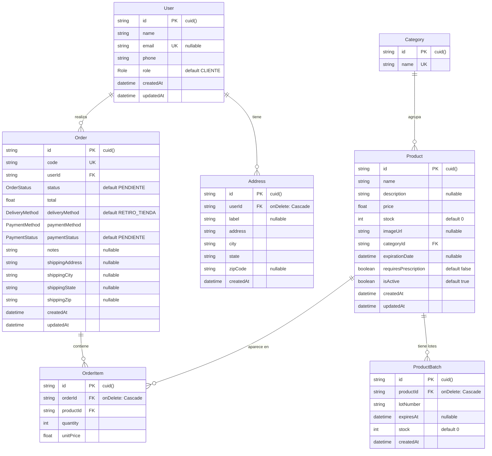

# Diagrama Entidad-Relación — pwa-pharmacy

Generado a partir de `prisma/schema.prisma` (SQLite).

## Notas

- **Enums:**
  - `OrderStatus`: `PENDIENTE`, `PROCESANDO`, `COMPLETADA`, `CANCELADA`.
  - `Role`: `CLIENTE`, `ADMIN`, `FARMACEUTICO`. El acceso al área de operador se concede a cualquier rol distinto de `CLIENTE`.
  - `DeliveryMethod`: `RETIRO_TIENDA`, `ENVIO_DOMICILIO`.
  - `PaymentMethod`: `EFECTIVO`, `TARJETA`, `TRANSFERENCIA`, `PAGO_MOVIL`.
  - `PaymentStatus`: `PENDIENTE`, `PAGADO`.
- **Category** normaliza las categorías de producto (FK `Product.categoryId`), evitando strings libres duplicados.
- **Address** es la libreta de direcciones del usuario (varias por usuario). Al crear un pedido a domicilio, la dirección se **copia** (snapshot) en los campos `shipping*` de `Order`, de modo que el pedido conserva la dirección aunque la libreta cambie.
- **ProductBatch** registra lotes (número, vencimiento, stock por lote) de forma **informativa**. La cifra autoritativa para los pedidos sigue siendo `Product.stock`, que se decrementa en la transacción atómica de creación de pedidos.
- `OrderItem` es la tabla pivote de la relación muchos-a-muchos entre `Order` y `Product`. `OrderItem.unitPrice` conserva el precio al momento de la compra.
- Al eliminar un `Order`, un `Product` o un `User` se eliminan en cascada sus `OrderItem` / `ProductBatch` / `Address` respectivamente.
- `User.email` y `Order.code` son únicos (UK); `Category.name` es único.
